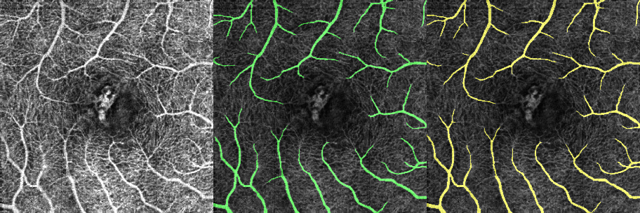
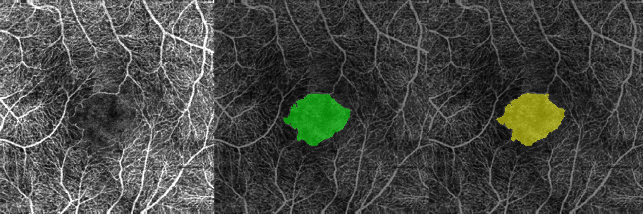
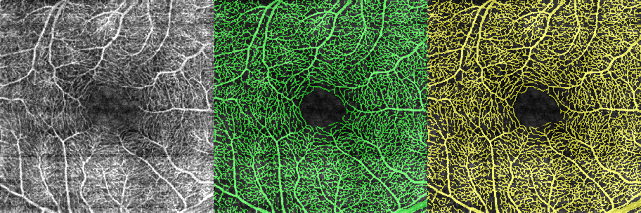
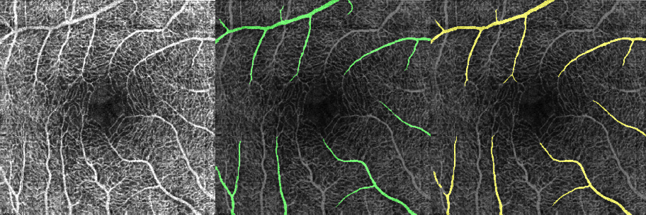

# Snake-SWin-OCTA

中文版README: [README_zh](./README_zh.md)

## 1.Quick Start

Here's a deep network built for efficient segmentation of OCTA retinal vessels using **dynamic snake convolution** and **swin-transformer**, constructed with **PyTorch**.

**Related works**

dynamic snake convolution：https://arxiv.org/abs/2307.08388

swin-transformer: https://arxiv.org/abs/2103.14030

Use **train.py** for model training. The warning informations will tell you which packages you should install. These packages are commonly used Python libraries without additional configuration.

    python train.py

The dataset should be formed as **OCTA-500**, like this:

    /datasets
        /OCTA-500
            /3M
                /GT_Artery
                    10301.bmp
                    10302.bmp
                    ...
                /GT_Capillary
                    10301.bmp
                    10302.bmp
                    ...
                /GT_FAZ
                ...
                /ProjectionMaps
                    /OCTA(FULL)
                        10301.bmp
                        10302.bmp
                        ...
                    /OCTA(ILM_OPL)
                        10301.bmp
                        10302.bmp
                        ...
                    /OCTA(OPL_BM)
                        10301.bmp
                        10302.bmp
                        ...
            /OCTA_6M
                ...

For reference, I have given several samples in each folder to check whether your dataset is placed correctly. If you want the complete dataset, you have to contact the author of the **OCTA_500** dataset.

**Note: The complete dataset is essential as the data samples are divided into training, validation, and testing sets based on the IDs. Failure to detect sample IDs will result in errors.**

**OCTA-500**'s related paper: : https://arxiv.org/abs/2012.07261

The results and metrics will recorded in the **results** folder (If it doesn't exist, it will be created).

If you need to visualize the prediction samples of results, please use the **display.py** file. Since the result folders are generated based on time, you may need to replace this line of code. The generated images are in the **sample_display** folder.

    ...
        result_dir = "results/2024-04-25-10-42-47/SwinSnake_V2_3_9_1_72_MaxPooling_1_False_3M_LargeVessel_100_#/0100" # Your result dir
    ...

We believe that the code provided in this repository is sufficient for successfully training the model and obtaining the expected results. However, as the related paper is currently under review, the settings, weights, and parameters cannot be disclosed at the moment. More detailed content and test code will be added after the paper is officially published.

## 2. Segmentation Samples and Important Notes

Here are segmentation examples randomly selected from the test and validation sets for different tasks. From left to right, they represent the input image, annotations (in green), and predicted results (in yellow).

**3M FoV**

*RV (retinal vessel)*

*FAZ*

*Capillary*

*Artery*

*Vein*

****

**6M FoV**

*RV*

*FAZ*

*Capillary*

*Artery*

*Vein*

****

Through experiments, it has been observed that for both **RV** and **capillary**, using lightweight models results in minimal degradation in segmentation performance. Training with this codebase requires a minimum of **3GB** of GPU memory. **Note** that the model can be freely configured by adjusting parameters such as **kernel size**, **network depth**, and **layer channels**, which will impact GPU memory consumption, training time, and segmentation effectiveness. The following table provides a simple reference for recommended configurations and segmentation performance：

| memory budget| RV & capillary | FAZ, artery & vein |
| ---   | ---  | --- |
| 3GB   | good | poor |
| 12GB  | good | moderate |
| 24GB  | good | good |

* "good, moderate and poor" in segmentation performance.

## 3. Others

If you wish to delve into more detailed reports, we recommend reading the related paper. If you find it helpful, please cite it accordingly : https://arxiv.org/abs/2404.18096
