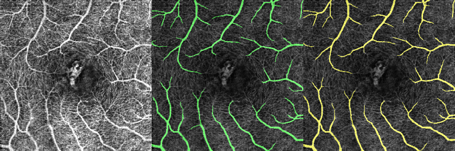
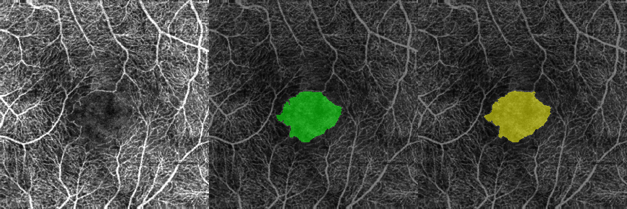
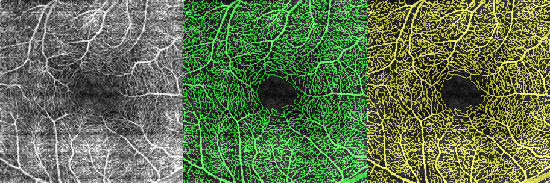
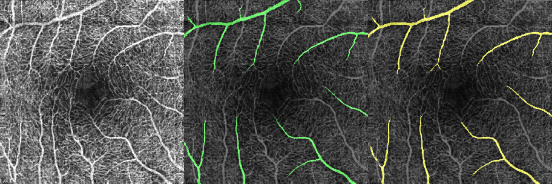
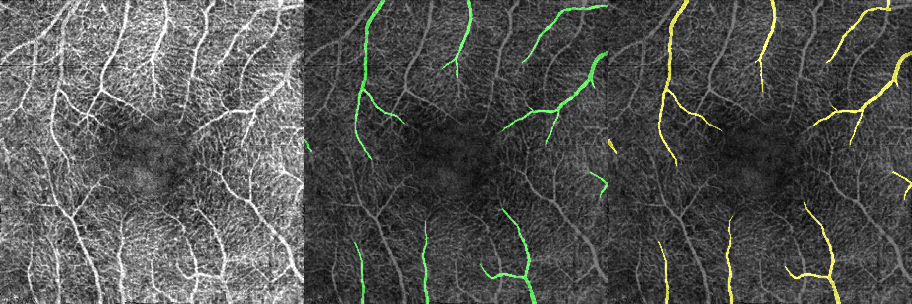

# Snake-SWin-OCTA

## 1.快速上手

这是一个使用**动态蛇形卷积**以及**swin-transformer**所构建的对OCTA视网膜血管进行高效分割的深度网络, 使用 **PyTorch** 构建。

**相关论文**

动态蛇形卷积：https://arxiv.org/abs/2307.08388

swin-transformer: https://arxiv.org/abs/2103.14030

使用 **train.py** 可以进行训练。警告信息将指导您应该去安装哪些包，这些包都是常用的python库，不需要额外的配置。

    python train.py

数据集应该按照 OCTA-500 的形式组织，就像这样:

    /datasets
        /OCTA-500
            /3M
                /GT_Artery
                    10301.bmp
                    10302.bmp
                    ...
                /GT_Capillary
                    10301.bmp
                    10302.bmp
                    ...
                /GT_FAZ
                ...
                /ProjectionMaps
                    /OCTA(FULL)
                        10301.bmp
                        10302.bmp
                        ...
                    /OCTA(ILM_OPL)
                        10301.bmp
                        10302.bmp
                        ...
                    /OCTA(OPL_BM)
                        10301.bmp
                        10302.bmp
                        ...
            /OCTA_6M
                ...

作为参考，我在每个文件夹中留下了少量样本，用于检查您的数据集是否存放正确。如果需要完整的数据集，需要联系 **OCTA_500** 数据集的作者。

**注意： 完整的数据集是必须的，因为数据样本会按照id划分为训练集、验证集和测试集。如果没有检测到样本id会产生报错。**

**OCTA-500**的相关论文: https://arxiv.org/abs/2012.07261

示例结果和分割指标将被记录在 **results** 文件夹中（如果不存在，则这个文件夹将被自动创建）。

如果您需要对预测结果进行可视化，请使用 **display.py** 文件。由于结果文件夹是按时间生成的，需要对这一行代码进行替换。生成的图像存放在 **sample_display** 文件夹中。

    ...
        result_dir = "results/2024-04-25-10-42-47/SwinSnake_V2_3_9_1_72_MaxPooling_1_False_3M_LargeVessel_100_#/0100" # 你的结果的文件夹路径
    ...

相信本仓库提供的代码足以成功训练模型并得到预期结果，由于相关论文还处于在投状态，所以设置、权重和参数暂时不能公布。更详细内容和测试代码将在论文发表后追加。

## 2. 效果展示与重要说明

这是不同任务下从测试集和验证集中随机选取的分割示例，从左到右分别是输入图像、标注（绿色）以及预测结果（黄色）。

**3M 视场角**

*视网膜血管*

*中心无血管区*

*毛细血管*

*动脉*

*静脉*

****

**6M 视场角**

*视网膜血管*

*中心无血管区*

*毛细血管*

*动脉*

*静脉*

****

经过实验，对于 **视网膜血管** 和 **毛细血管** 而言，使用轻量化的模型在分割性能上几乎不会下降。使用这套代码进行训练的话，需要至少 **3GB** 的显存。**注意**，该模型是可以通过参数自由地对 **卷积核大小**、**网络层数** 以及 **层通道数** 进行增减配置的，这些参数将对模型所占显存、训练时间以及分割效果产生影响。下表是对推荐配置和分割效果的简单参考：

| 模型占用显存 | 视网膜血管、毛细血管 | 中心无血管区、动静脉 |
| ---   | --- | --- |
| 3GB   | 强 | 弱 |
| 12GB  | 强 | 中 |
| 24GB  | 强 | 强 |

* “弱、中、强” 指分割效果。

## 3. 其他

如果您想要了解更为详细的报告，推荐您阅读这篇相关论文，如果觉得有用请引用标注：https://arxiv.org/abs/2404.18096

